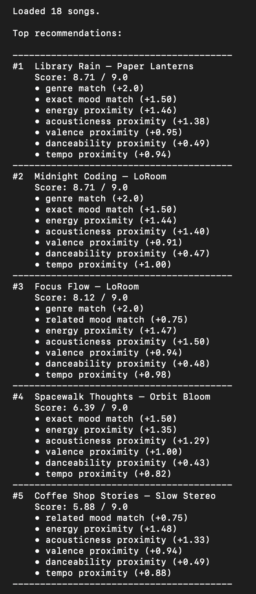
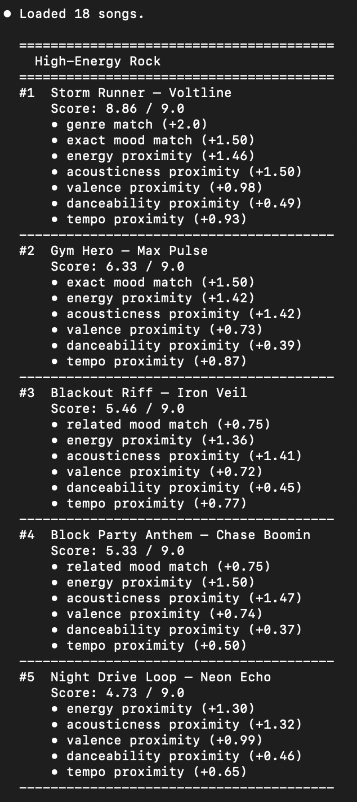
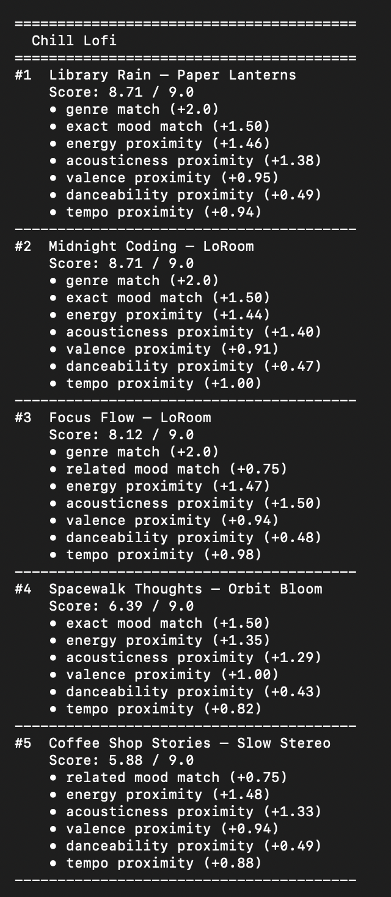
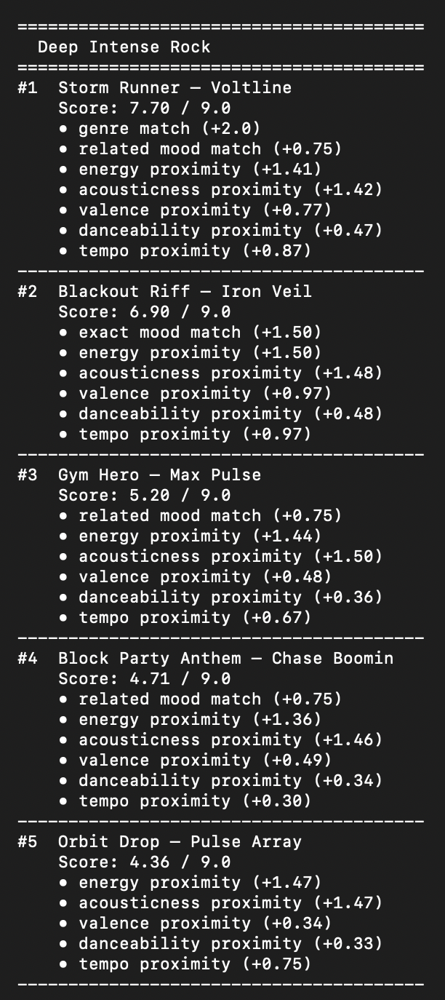
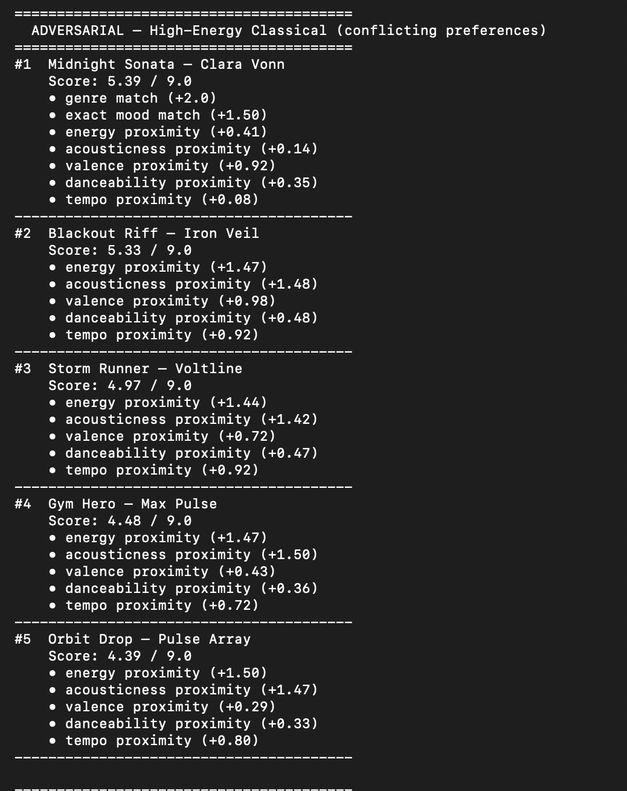
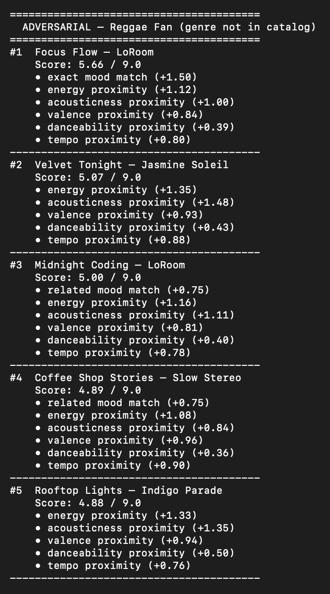
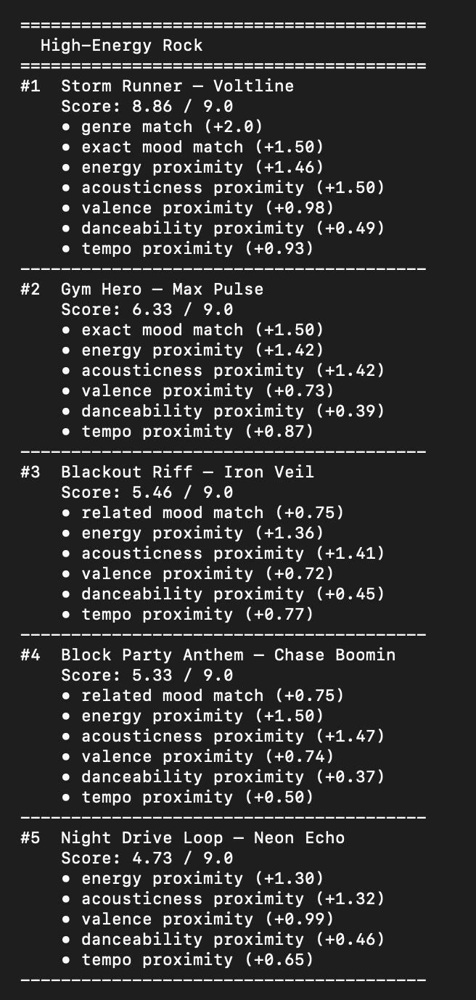
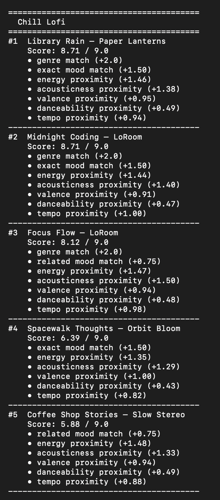
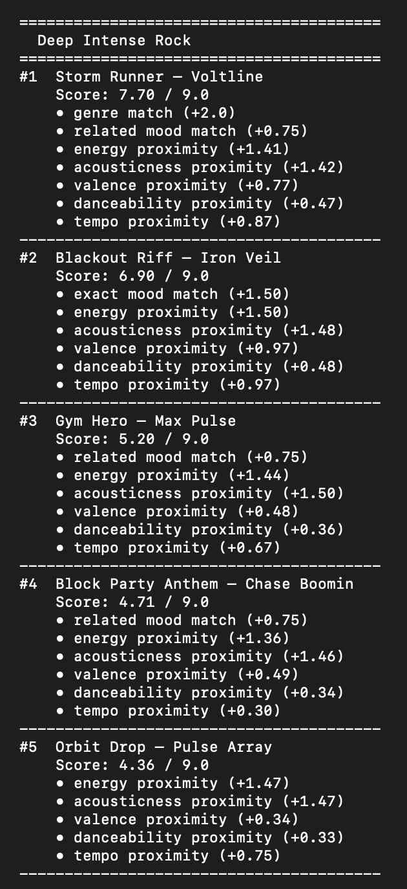
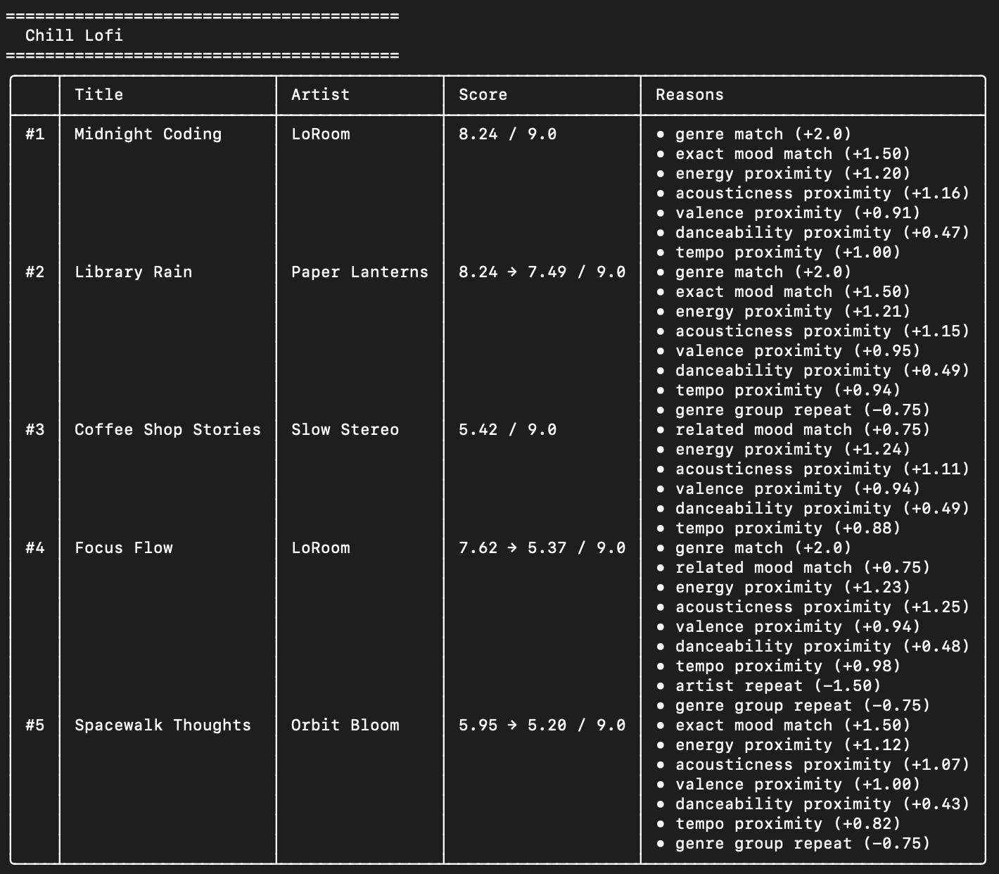

# 🎵 Music Recommender Simulation

## Project Summary

TuneFit 1.0 is a CLI music recommender that scores 18 songs against a user taste profile and returns the top 5 matches with a plain-language explanation for each result. It uses content-based filtering — no user history, no collaborative data — just audio features compared directly to what the user says they want.

Each song is scored on seven signals: genre match (+2.0), exact mood match (+1.5), related mood match (+0.75), and proximity scores for energy, acousticness, valence, danceability, and tempo. The highest-scoring songs are returned in ranked order with per-contribution breakdowns so you can see exactly why each song placed where it did.

The project was built and stress-tested across five user profiles — including two adversarial cases designed to expose weaknesses in the scoring logic. Key findings: the genre bonus can anchor a mismatched song to #1 when a genre has only one representative in the catalog, and mood matching is load-bearing — removing it caused emotionally misaligned results even when genre and audio features were correct.

---

## How The System Works

Real-world recommendation systems like Spotify use content-based filtering to match a song's audio features to a user's taste profile. Rather than simply preferring high or low values, they reward songs whose features are *close* to what the user wants. This system follows the same approach: each song is scored against the user's preferences using a weighted formula, and the highest-scoring songs are returned as recommendations.

**Algorithm recipe — scoring weights:**

| Component | Weight | How it's applied |
|---|---|---|
| Genre match | 2.0 | +2.0 if song genre exactly matches `favorite_genre`, else 0 |
| Mood match — exact | 1.5 | +1.5 if song mood exactly matches `favorite_mood` |
| Mood match — related | 0.75 | +0.75 if song mood is in the same group (e.g. `chill` ↔ `relaxed` ↔ `focused`) |
| Energy | 1.5 | `1 − \|target − song\|` × 1.5 |
| Acousticness | 1.5 | `1 − \|target − song\|` × 1.5 |
| Valence | 1.0 | `1 − \|target − song\|` × 1.0 |
| Tempo | 1.0 | `1 − \|target − song\| ÷ 100` × 1.0 |
| Danceability | 0.5 | `1 − \|target − song\|` × 0.5 |
| **Max total** | **9.0** | |

**How scoring and ranking work together:**

Every song in the catalog is scored individually against the user profile, producing a number between 0 and 9.0. Genre carries the highest single weight because it acts as a shorthand for a cluster of sonic properties — knowing a song is lofi already predicts its energy, acousticness, and tempo range. Mood uses soft matching so semantically similar moods earn partial credit rather than scoring zero. The four numeric features reward songs that *feel* close to the user's targets: energy and acousticness are weighted highest because they have the widest spread across the catalog and do the most to separate genres; danceability is weighted lowest because in this dataset it barely varies between similar songs. Once every song has a score, all results are sorted high-to-low and the top K are returned with a plain-English explanation of why each song matched.

**Potential biases:**

- **Genre anchoring.** Genre carries the highest weight, so a song that perfectly matches the user's mood and numeric targets in a different genre will often lose to a weaker match in the user's favorite genre. A great ambient track may be buried below a mediocre lofi one for a lofi-preference user.
- **Hand-coded mood groups.** The soft mood groupings (`chill → relaxed → focused`, etc.) reflect one designer's intuition, not user research. Someone might reasonably feel that `moody` and `focused` belong together, or that `relaxed` and `chill` are not interchangeable.
- **Tempo normalization is arbitrary.** Dividing the tempo gap by 100 is a judgment call. A different divisor would shift how much tempo influences results relative to the other features.
- **Small catalog amplifies noise.** With 18 songs, a small weight change can flip rankings. Patterns that look meaningful here may not hold as the catalog grows.

**`Song` features:**
- `energy` — intensity level (0.0–1.0)
- `acousticness` — how acoustic vs. produced the track is (0.0–1.0)
- `valence` — musical positivity, happy to melancholic (0.0–1.0)
- `danceability` — how suitable the track is for dancing (0.0–1.0)
- `tempo_bpm` — beats per minute
- `mood` — label: `happy`, `chill`, `intense`, `relaxed`, `focused`, `moody`, `sad`, `melancholic`, `energetic`, `romantic`, `angry`, `euphoric`
- `genre` — label: `pop`, `lofi`, `rock`, `ambient`, `synthwave`, `jazz`, `indie pop`, `classical`, `hip-hop`, `r&b`, `country`, `folk`, `metal`, `blues`, `edm`

**`UserProfile` stores:**
- `favorite_genre` and `favorite_mood` — categorical preferences
- `target_energy`, `target_acousticness`, `target_valence`, `target_danceability` — numeric targets (0.0–1.0)
- `target_tempo_bpm` — desired tempo in beats per minute

---

## Sample Output

<details>
<summary>Chill Lofi — early run</summary>



</details>

### Full Run — All Profiles

<details>
<summary>ADVERSARIAL — High-Energy Classical (conflicting preferences)</summary>



</details>

<details>
<summary>ADVERSARIAL — Reggae Fan (genre not in catalog)</summary>



</details>

<details>
<summary>High-Energy Rock</summary>




</details>

<details>
<summary>Chill Lofi</summary>




</details>

<details>
<summary>Deep Intense Rock</summary>




</details>

### Challenge 4 — Formatted Table Output



---

## Getting Started

### Setup

1. Create a virtual environment (optional but recommended):

   ```bash
   python -m venv .venv
   source .venv/bin/activate      # Mac or Linux
   .venv\Scripts\activate         # Windows

2. Install dependencies

```bash
pip install -r requirements.txt
```

3. Run the app:

```bash
python -m src.main
```

### Running Tests

Run the starter tests with:

```bash
pytest
```

You can add more tests in `tests/test_recommender.py`.

---

## Experiments You Tried

Use this section to document the experiments you ran. For example:

- What happened when you changed the weight on genre from 2.0 to 0.5
- What happened when you added tempo or valence to the score
- How did your system behave for different types of users

---

## Limitations and Risks

Summarize some limitations of your recommender.

Examples:

- It only works on a tiny catalog
- It does not understand lyrics or language
- It might over favor one genre or mood

You will go deeper on this in your model card.

---

## Reflection

Read and complete `model_card.md`:

[**Model Card**](model_card.md)

Write 1 to 2 paragraphs here about what you learned:

- about how recommenders turn data into predictions
- about where bias or unfairness could show up in systems like this


---

## 7. `model_card_template.md`

Combines reflection and model card framing from the Module 3 guidance. :contentReference[oaicite:2]{index=2}  

```markdown
# 🎧 Model Card - Music Recommender Simulation

## 1. Model Name

Give your recommender a name, for example:

> VibeFinder 1.0

---

## 2. Intended Use

- What is this system trying to do
- Who is it for

Example:

> This model suggests 3 to 5 songs from a small catalog based on a user's preferred genre, mood, and energy level. It is for classroom exploration only, not for real users.

---

## 3. How It Works (Short Explanation)

Describe your scoring logic in plain language.

- What features of each song does it consider
- What information about the user does it use
- How does it turn those into a number

Try to avoid code in this section, treat it like an explanation to a non programmer.

---

## 4. Data

Describe your dataset.

- How many songs are in `data/songs.csv`
- Did you add or remove any songs
- What kinds of genres or moods are represented
- Whose taste does this data mostly reflect

---

## 5. Strengths

Where does your recommender work well

You can think about:
- Situations where the top results "felt right"
- Particular user profiles it served well
- Simplicity or transparency benefits

---

## 6. Limitations and Bias

Where does your recommender struggle

Some prompts:
- Does it ignore some genres or moods
- Does it treat all users as if they have the same taste shape
- Is it biased toward high energy or one genre by default
- How could this be unfair if used in a real product

---

## 7. Evaluation

How did you check your system

Examples:
- You tried multiple user profiles and wrote down whether the results matched your expectations
- You compared your simulation to what a real app like Spotify or YouTube tends to recommend
- You wrote tests for your scoring logic

You do not need a numeric metric, but if you used one, explain what it measures.

---

## 8. Future Work

If you had more time, how would you improve this recommender

Examples:

- Add support for multiple users and "group vibe" recommendations
- Balance diversity of songs instead of always picking the closest match
- Use more features, like tempo ranges or lyric themes

---

## 9. Personal Reflection

A few sentences about what you learned:

- What surprised you about how your system behaved
- How did building this change how you think about real music recommenders
- Where do you think human judgment still matters, even if the model seems "smart"

