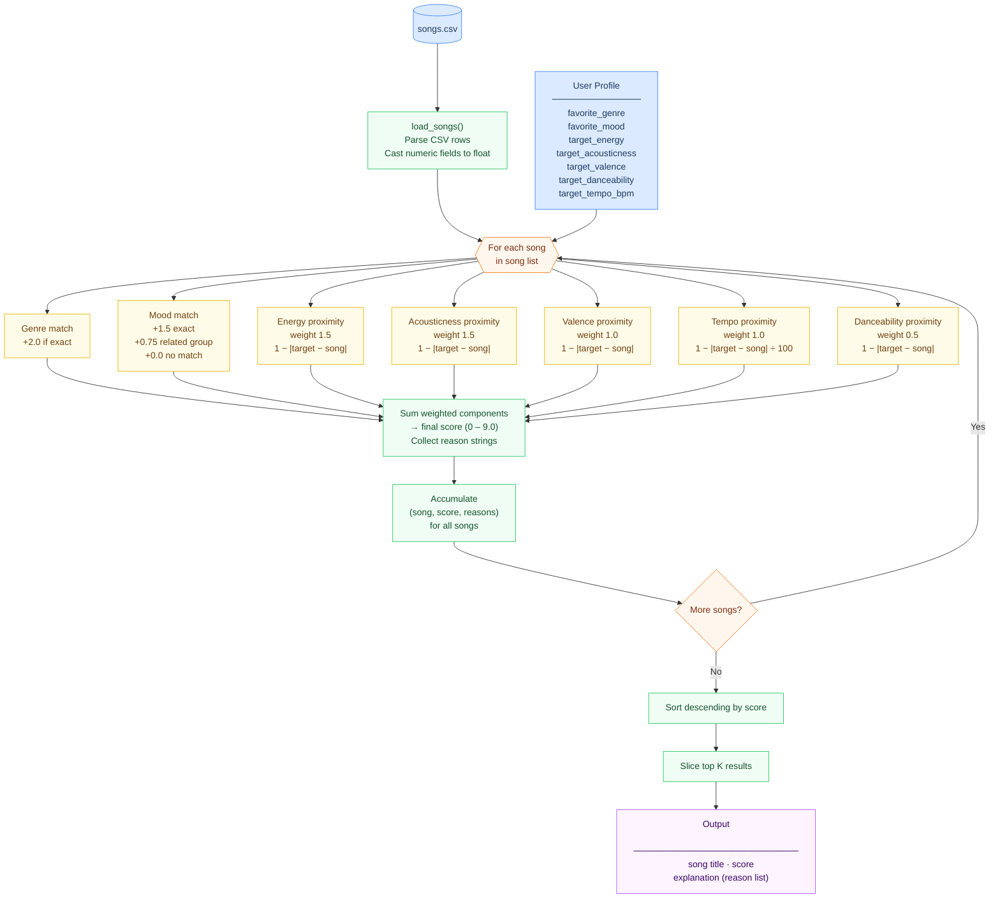

# Music Recommender — Data Flow

## Weight reference

| Component | Weight | Match type |
|---|---|---|
| Genre | 2.0 | Exact categorical |
| Mood (exact) | 1.5 | Exact categorical |
| Mood (related group) | 0.75 | Soft categorical |
| Energy | 1.5 | Proximity `1 − \|Δ\|` |
| Acousticness | 1.5 | Proximity `1 − \|Δ\|` |
| Valence | 1.0 | Proximity `1 − \|Δ\|` |
| Tempo | 1.0 | Proximity `1 − \|Δ\| ÷ 100` |
| Danceability | 0.5 | Proximity `1 − \|Δ\|` |
| **Max total** | **9.0** | |
